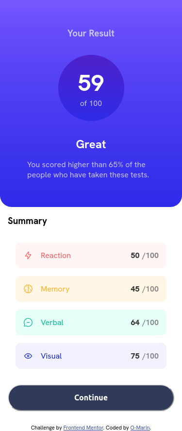
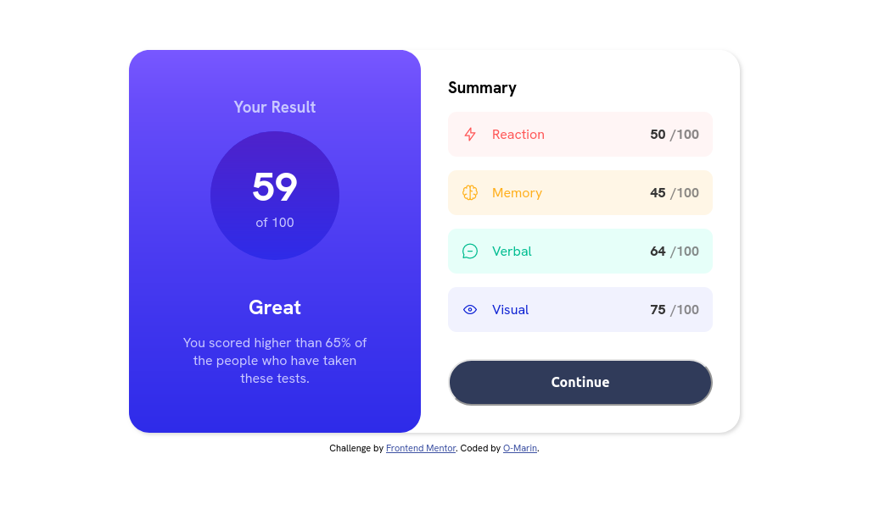

# Frontend Mentor - Results summary component solution

This is a solution to the [Results summary component challenge on Frontend Mentor](https://www.frontendmentor.io/challenges/results-summary-component-CE_K6s0maV). Frontend Mentor challenges help you improve your coding skills by building realistic projects. 

## Table of contents

- [Overview](#overview)
  - [The challenge](#the-challenge)
  - [Screenshot](#screenshot)
  - [Links](#links)
- [My process](#my-process)
  - [Built with](#built-with)
  - [What I learned](#what-i-learned)
  - [Continued development](#continued-development)
  - [Useful resources](#useful-resources)
- [Author](#author)
- [Acknowledgments](#acknowledgments)

## Overview

### The challenge

Users should be able to:

- View the optimal layout for the interface depending on their device's screen size
- See hover and focus states for all interactive elements on the page
- **Bonus**: Use the local JSON data to dynamically populate the content

### Screenshot

	| 

### Links

- Solution URL: [https://github.com/O-Marin/result-summary-component](https://github.com/O-Marin/result-summary-component)
- Live Site URL: [https://o-marin.github.io/result-summary-component/](https://o-marin.github.io/result-summary-component/)

## My process

 With this one I had to rethink how I approach the challenges, I realized I was making mistakes and had presupositions that shouldn't there.
 I hope I carry the lessons foward. I started learning javascript basics after tackling the bonus in this challenge, so my code was a mess(maybe still is),
 and started over a couple times, each time a bit more tidy, hopefully reaching a state where it's comprehensible for most if not all.
 
 I don't really know what to add in this segment. Probably its more personal, like a space for me to stop a think of what I've learned.
 I took way too long for this one but in the during the challenge I realized I needed to walk and get some sun time, and "fresh" air.
 It does help in clearning the mind and thinking more peacefully.
 
 I don't know if this is a good practice or common but it's not the first time I try deleting code and start it over applying what I have learned, to get out
 of a "lock-state", sort of a reset. the second or third code is tidier. It helps me use a different approach instead of tunneling into the one I thought it had to be.
 
 -end-

### Built with

- Semantic HTML5 markup
- CSS custom properties
- Flexbox
- Mobile-first workflow
- Javascript
- Fetch API

### What I learned
How to use CSS gradients
How to use fetch() to grab data from a .json file and use it in my webpage.
Trained my loops.

### Continued development

I need to practice loops more and in different situations to develop a more intuitive understanding of how they work.

## Author

- Website - [Oscar](https://github.com/O-Marin)
- Frontend Mentor - [@O-Marin](https://www.frontendmentor.io/profile/O-Marin)

